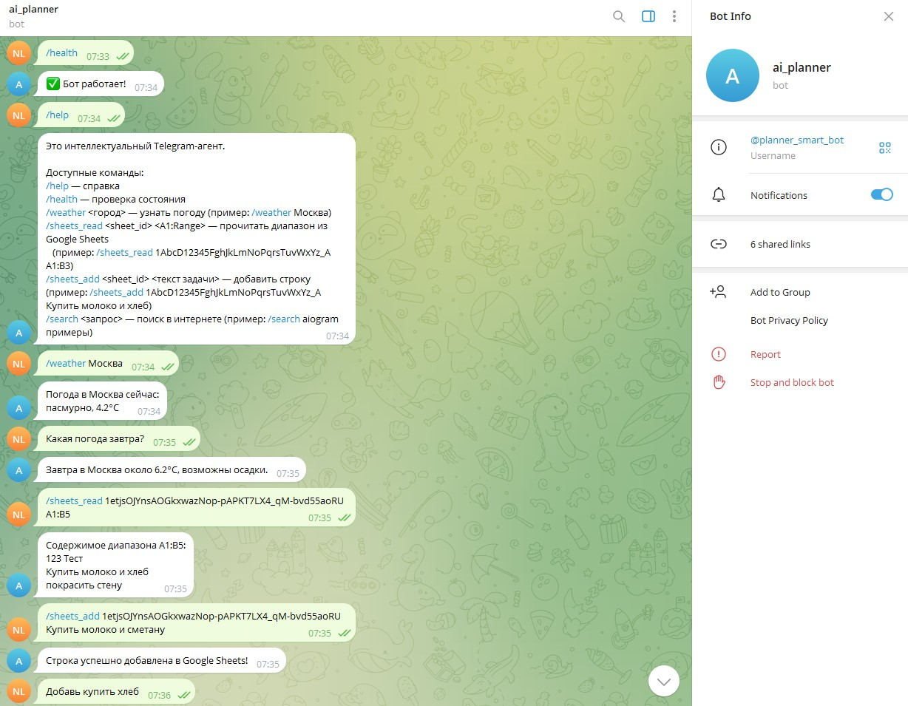
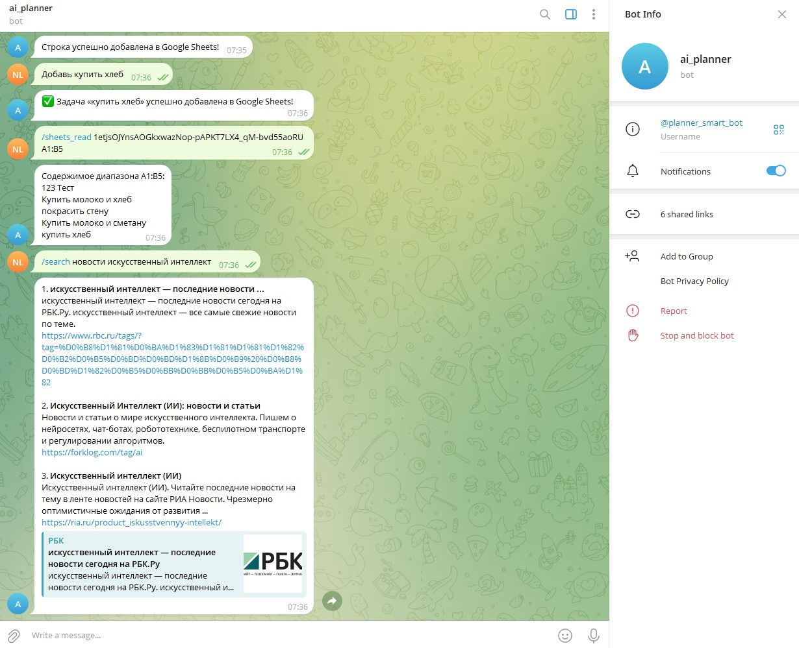

# Telegram Intellect AI Agent

Многофункциональный интеллектуальный Telegram-агент-помощник с поддержкой внешних MCP-инструментов, диалоговой памяти и векторной базы знаний.

## Назначение проекта

Telegram-агент предназначен для организации персонального вспомогательного чат-бота с расширяемым набором инструментов: запросы к погодным сервисам, поисковикам, Google Sheets, работа с контекстом и знаниями.

---

## Установка и запуск

### 1. Локально (без Docker)

git clone https://github.com/NikaL25/telegram_intellect_ai_agent.git
cd telegram_intellect_ai_agent

```bash
python3 -m venv venv
source venv/bin/activate  # для Linux/macOS
venv\Scripts\activate    # для Windows
pip install -r requirements.txt
```

Создайте файл `.env` и заполните нужные ключи (см. ниже).

```bash
python main.py
```

### 2. Через Docker

```bash
docker-compose up --build -d    # Сборка и запуск
# Проверка логов
docker-compose logs -f          # Для остановки: docker-compose down
```

---

## Настройка API-ключей (.env)

Создайте файл .env в корне проекта:

```
BOT_TOKEN=...               # Telegram Bot Token
WEATHER_API_KEY=...         # Ключ OpenWeatherMap
GSHEETS_CREDENTIALS_PATH=/app/secrets/service_account.json   # путь внутри контейнера
SERPAPI_KEY=...             # Ключ SerpAPI
```

- Для Google Sheets скачайте service_account.json и поместите его в ./secrets. Расшарьте нужные таблицы на сервисный email.

---

## Базовые команды Telegram-бота

- `/help` — список доступных команд
- `/health` — быстрая проверка работоспособности
- `/weather <город>` — узнать погоду
- `/sheets_read <sheet_id> <A1:Range>` — получить значения из Google Sheets
- `/search <запрос>` — поиск Google через SerpAPI
- `/ask_kb <вопрос>` — поиск по базе знаний (если интегрирован)

Пример:

```
/weather Москва
/sheets_read 1etjsOJYnsAOGkxwazNop-pAPKT7LX4_qM-bvd55aoRU A1:B10
/search aiogram примеры
```

---

## Добавление новых MCP-инструментов

1. Создайте новый модуль в папке `/mcp`, реализовав класс-инструмент с нужным внешним API или функциональностью.
2. Добавьте его импорт и инициализацию в `bot.py`.
3. Впишите новую команду-обработчик, которая использует MCP-клиент.
4. Описание и тестирование нового функционала — обновите /help!

---

## Работа с памятью бота

- Каждый чат с ботом сохраняется в таблице SQLite (`memory/session_memory.db`).
- Методы `add_message` и `get_history` управляют записью в базу.
- История используется для поддержки долгосрочного контекста в диалогах, организации персонализированных ответов, аналитики, интеграции с LLM.

```python
from memory.memory import SessionMemory
mem = SessionMemory()
mem.add_message('123', 'user', 'Привет!')
history = mem.get_history('123')
```

---

## Работа с векторной базой знаний

- Все документы преобразуются в векторы через SentenceTransformers.
- Для добавления факта/статьи используйте:

```python
from knowledge_base.vector_db import VectorKnowledgeBase
kb = VectorKnowledgeBase()
k.badd_document('fact-1', 'Python — это язык программирования.')
results = kb.query('Что такое Python?')
```

- Документы хранятся в каталоге `knowledge_base/chroma_data/`, база автоматически обновляется и не теряется при перезапуске.
- Используйте ответы базы знаний для расширения возможностей бота: справка, FAQ, поиск фактов.

---

## Вклад для разработчиков (Contribution)

- Расширяйте новые MCP и команды.
- Загружайте дополнительные справочные документы для векторной базы.
- Делайте пулреквесты с улучшениями!

---

## Контакты и поддержка

Вопросы, баги, идеи — создавайте issue или пишите мейнтейнеру.

## Пример диалога

```
/health
/help
/weather Москва
Какая погода завтра?
/sheets_read 1etjsOJYnsAOGkxwazNop-pAPKT7LX4_qM-bvd55aoRU A1:B5
/sheets_add 1etjsOJYnsAOGkxwazNop-pAPKT7LX4_qM-bvd55aoRU Купить молоко и хлеб
/search новости искусственный интеллект
Добавь купить хлеб
```

🧪 Ожидаемые ответы

🧪 **Ожидаемые ответы**

1️⃣ `/health`  
✅ Бот работает!

2️⃣ `/help`  
Показывает список доступных команд и описание функций.

3️⃣ `/weather Москва`  
Погода в Москве сейчас: облачно с прояснениями, ~5°C.

4️⃣ `Какая погода завтра?`  
Завтра в Москве около 6.2°C, возможны осадки.

5️⃣ `/sheets_read … A1:B10`  
Выводит содержимое таблицы в заданном диапазоне (пример):

```
123    Тест
```

6️⃣ `/sheets_add … Купить молоко и хлеб`  
✅ Задача добавлена в Google Sheets.

7️⃣ `/search новости искусственный интеллект`  
Выводит список 2–3 релевантных ссылок и краткие описания.

8️⃣ `А какая завтра погода в Москве?`  
Показывает прогноз на завтра, используя память контекста.

## Пример Работы

/health

# Ответ: ✅ Бот работает!

/help

# Ответ: Это интеллектуальный Telegram-агент.

# Доступные команды:

# /help — справка

# /health — проверка состояния

# /weather <город> — узнать погоду (пример: /weather Москва)

# /sheets_read <sheet_id> <A1:Range> — прочитать диапазон из Google Sheets

# /sheets_add <sheet_id> <текст задачи> — добавить строку (пример: /sheets_add 1AbcD... Купить молоко и хлеб)

# /search <запрос> — поиск в интернете (пример: /search aiogram примеры)

/sheets_add 1etjsOJYnsAOGkxwazNop-pAPKT7LX4_qM-bvd55aoRU Купить масло

# Ответ: Строка успешно добавлена в Google Sheets!

/sheets_read 1etjsOJYnsAOGkxwazNop-pAPKT7LX4_qM-bvd55aoRU A1:B5

# Ответ: Содержимое диапазона A1:B5:

# 123 Тест

# ...

Добавь купить молоко

# Ответ: ✅ Задача «купить молоко» успешно добавлена в Google Sheets!

/weather Москва

# Ответ: Погода в Москва сейчас:

# Ясно, 15°C



